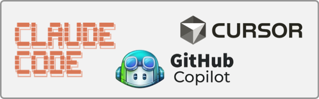
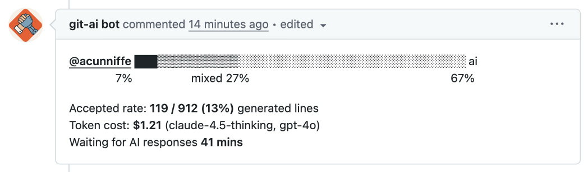

<h1 align="left"><b>git-ai</b></h1>

<p align="left">Track the AI Code in your repositories</p>

## Quick Start 

#### Mac, Linux, Windows (WSL)

```bash
curl -sSL https://raw.githubusercontent.com/acunniffe/git-ai/main/install.sh | bash
```

#### Windows (non-WSL - experimental)

```powershell
powershell -NoProfile -ExecutionPolicy Bypass -Command "irm https://raw.githubusercontent.com/acunniffe/git-ai/main/install.ps1 | iex"
```

🎊 That's it! No per-repo setup. Once installed `git-ai` will work OOTB with any of **Supported Agents** *More coming soon*:



#### Next step: **Just code and commit!**
The Coding Agents (above) use `git-ai` to mark all the code they generate as AI-authored. 

On commit, `git-ai` adds a note that tracks which lines were AI-authored andoutput AI stats:

 

If you're curious about the AI authorship of any file `git-ai blame` will show you which lines are AI generated:


## Goals of `git-ai` project

🤖 **Track AI code in a Multi-Agent** world. Because developers get to choose their tools, engineering teams need a **vendor agnostic** way to track AI impact and keep track of the AI code in their repos. 

🎯 **Accurate attribution** from Laptop → Pull Request → Merged. Claude Code, Cursor and Copilot do not count correctly because they can not see what happens to code after it's generated. 

🔄 **Support real-world git workflows** by making sure AI-Authorship annotations survive a `merge --squash`, `rebase`, `reset`, `cherry-pick` etc.

🔗 **Maintain link between prompts and code** - there is a lot of valuable context and requirments in your team's prompts -- don't throw them away. 

🚀 **Git-native + Fast** - `git-ai` is built on git plumbing commands. Unnoticiable impact even in xxl repos (<100ms). **we test in [Chromium](https://github.com/chromium/chromium)**


## Agent Support

`git-ai` automatically sets up all supported agent hooks using the `git-ai install-hooks` command

| Agent/IDE | Authorship | Prompts |
| --- | --- | --- |
| [Cursor >1.7](https://usegitai.com/docs/agent-support/cursor) | ✅ | ✅ |
| [Claude Code](https://usegitai.com/docs/agent-support/claude-code) | ✅ | ✅ |
| [GitHub Copilot in VSCode via Extension](https://usegitai.com/docs/agent-support/vs-code-github-copilot) | ✅ | ✅ |
| OpenAI Codex (waiting on [openai/codex #2904](https://github.com/openai/codex/pull/2904)) |  |  |
| Sourcegraph Cody + Amp |  |  |
| Windsurf |  |  |
| RovoDev CLI |  |  |
| _your agent here_ |  |  |

> **Want to add yours?** All PRs welcome! Add documentation to `docs/agent-support/`


## How `git-ai` works 
[▶️ Video](https://youtube.com) [🗺️ Diagram](https://github.com/acunniffe/git-ai)


## Installing the PR Bot (in development)

> [Request early access here](https://calendly.com/acunniffe/meeting-with-git-ai-authors)




## Guides
