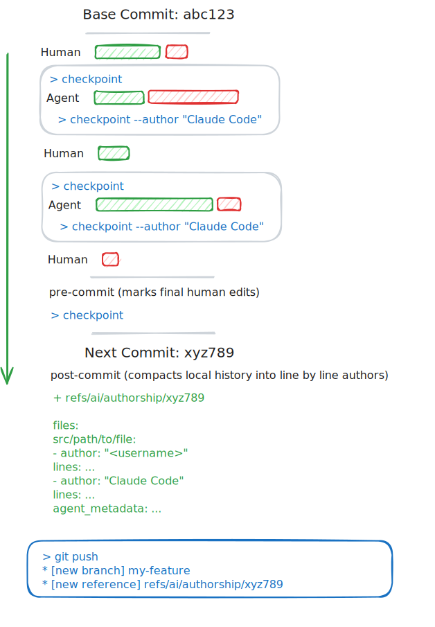

<div align="center"></div>
<h1 align="center"><b>git-ai</b></h1>
<p align="center">Save your prompts and keep track of code generated by AI.</p>

<p align="center"><code>curl -sSL https://gitai.run/install | bash</code></p>

```bash
git blame src/log_fmt_authorship.rs
```

https://github.com/user-attachments/assets/74b49493-92af-4627-934a-a3c161dbb49f


## Install

`git-ai` is implimented as a git proxy. It passes commands, args and flags to your `git` binary. You and your IDEs won't notice the difference, but all your code will be annotated with AI Authorship.

```bash
curl -sSL https://gitai.run/install | bash
```

> **Recommended**: add an `alias git=git-ai` to your shell config

> Alternative (more flaky): update your IDEs and SCM GUI tool's git paths to `bin/git-ai` and favor `git-ai` over `git` when running commmands you manually.

### Agent Setup

**Supported:**

[x] [Cursor via Extension](https://marketplace.cursorapi.com/items/?itemName=acunniffe.cursor-git-ai). Source and documentation are [here](/agent-support//cursor//README.md)

[x] [Claude Code via Hooks](/agent-support/claude-code.md)

**Help needed:**

[ ] Sourcegraph Cody + Amp

[ ] OpenAI Codex

[ ] Windsurf

[ ] RovoDev CLI
_...your tool_

> **Want to add yours?** All PRs welcome! Add documentation or plugin code to `/agent-support/{tool-name}.md`

**Manually:**

If you want to manually mark code as written by you or your agent.

Before submitting your prompt run checkpoint to attribute any new working copy changes to yourself.

```
git-ai checkpoint
```

After the AI has applied its changes, run checkpoint with the name of the agent you're using. This will apply the latest (generated) working copy changes to the agent.

```
git-ai checkpoint --author "Claude Code"
```

## Why `git-ai`?

`git blame` attributes all code to the commit's author, even when much of it is AI-generated.

**⭐️Git-native** - enhanced authorship is stored in Git and linked to commit hashes.

**🫡Simple and explicit** - no file system monitors, keyloggers or batch-write heuristics. Supported Agents call `git-ai checkpoint --author "Claude Code" --model claude-4-sonnet` after writing code.

**🤞Emerging Standard** - developers have tool choice, and they're likely using a mix of Claude Code, Codex, Cursor, etc.

**⚡️Fast + Cross Platform** - implemented in Rust, as fast as `git status`, and built on [`libgit2`](https://github.com/libgit2/libgit2)

### How it works

`git-ai` uses checkpoints to establish authorship of specific lines of code. Agents call `git-ai checkpoint` before they write to the file system to mark any previous edits as yours. After they write to the file system they call `checkpoint --author 'Claude Code' --model 'claude-4-sonnet'` to mark their contribution as AI-generated. These checkpoints work similarly to how IDEs handle local history and they do not leave your machine.

When you commit code, the base commit's checkpoints are compacted into a much smaller authorship log that is linked to your commit.



# For toolbuilders

## The Standard (draft-1)

Authorship logs, attached to commits, pushed to the `refs/ai/authorship` as blob objects.

- Authorship logs MUST be named `refs/ai/authorship/{commit-sha}`. MUST be the full SHA
- Authorship logs SHOULD be saved for every commit, but implementations MUST not fail if they are not provided.
- Authorship logs MUST be a valid JSON object with the following properties:
  - `schema_version` MUST use semantic versioning. Options: `authorship/0.0.1`
  - `files` MUST be a map of git file names -> `authors[]`
    - `author` MUST be a string. Agents SHOULD use their full name. Human developers SHOULD use their `git.config.name`
    - `lines` MUST be an array of added lines. Items MUST be an integer or a range tuple `[start-int, end-int]`. Range MUST be inclusive.
    - `agent_metadata`
      - SHOULD be `null` for humans
      - SHOULD be an object for agents
        - MUST have `model` (a string), that SHOULD be the model's name as it is provided to the API (ie `claude-4-sonnet`, not `Claude 4, Sonnet`).
        - MAY have any other properties of any other type.

```json file="refs/ai/authorship/f46b403b4f269bd2530b2d91a676449787886d02"
{
  "schema_version": "authorship/0.0.1",
  "files": {
    "src/main.rs": {
      "file": "src/main.rs",
      "authors": [
        {
          "author": "Claude Code",
          "lines": [12, [91, 101]],
          "agent_metadata": {
            "model": "claude-4-sonnet"
          }
        },
        {
          "author": "Aidan Cunniffe",
          "lines": [57],
          "agent_metadata": null
        }
      ]
    }
  }
}
```

**Coming next**: Prompt saving that maintains pointers to specific lines of code, across files.

### Adding Support to Your Agents

#### Via User-Installed CLI (Recommended)

Adding `git-ai` support to a coding agent is easy. You just have to call `git-ai checkpoint` once before writing to the file system and once immediately after your writes have completed. The `checkpoint` command has similar performance to `git status` and will not noticeably slow down your Agent's performance (we're talking ~100ms).

**Requirements:**

- Agents SHOULD check if `git-ai` is installed when they start and only try to log checkpoints if the user has it installed.
- Agents SHOULD write checkpoints to every git repo if the user has git-ai installed, no opt-in needed.
- Agents MUST only call `git-ai checkpoint` command from within a git repo. At the root or any sub directory will work.
- Agents MUST call `git-ai checkpoint` and wait for the command to finish before writing to the file system.
- Agents MUST call `git-ai checkpoint` immediately after writing generated code to the file system.
- Agents SHOULD not try to handle errors from the checkpoint command. Log them to the user to encourage them to fix or uninstall tool if it persists.

#### Via Rust Library

If you want to call `git-ai checkpoint` using a packaged rust binary and bindings, open an issue with runtime, language, and other details so we can provide the exact bindings you need. We'll provide a function like this that will run checkpoint without the CLI overhead.

**Note**: We suggest you adopt the CLI approach first, help make this a standard by providing great feedback, and then set up the deeper integration.

```rust
pub fn checkpoint_internal(
    repo_path: &str,
    author: &str,
    model: Option<&str>,
    human_author: Option<&str>,
) -> Result<(usize, usize, usize), GitAiError>
```

### Known limitiaitons

- Authorship logs will not survive a rebase. Possible, but requires merging authorship logs in a `post-rewrite` hook.

### Development Setup

```bash
git clone https://github.com/acunniffe/git-ai.git
cd git-ai
cargo build
cargo test
```

### License

MIT
